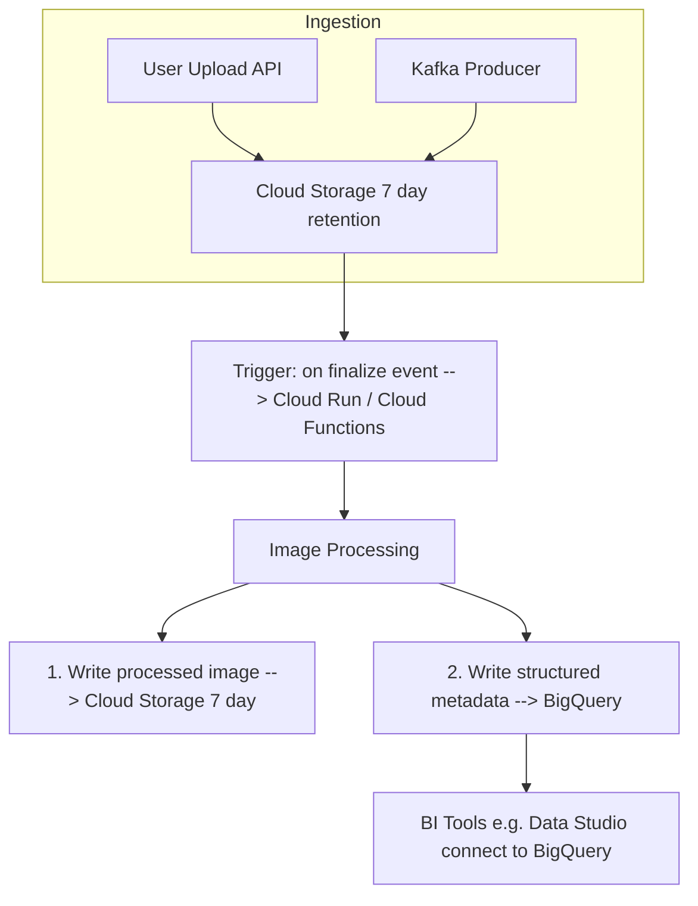
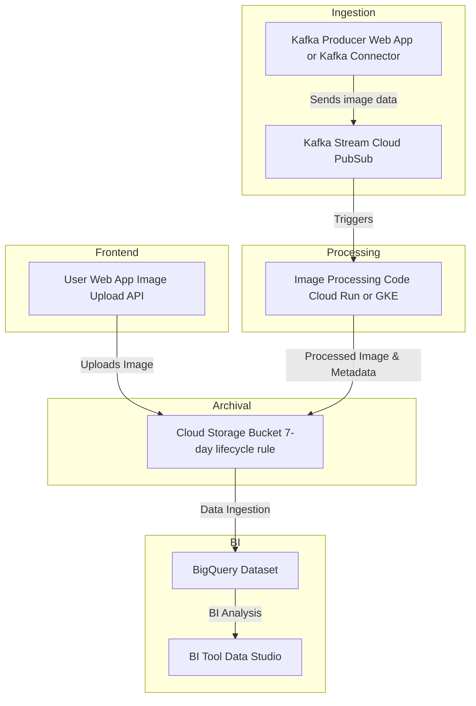

```mermaid
flowchart TD
    subgraph Ingestion
        A[User Upload API] --> C[Cloud Storage 7 day retention]
        B[Kafka Producer] --> C
    end

    C --> D[Trigger: on finalize event --> Cloud Run / Cloud Functions]

    D --> E[Image Processing]
    E --> E1[1. Write processed image --> Cloud Storage 7 day]
    E --> E2[2. Write structured metadata --> BigQuery]

    E2 --> F[BI Tools e.g. Data Studio connect to BigQuery]
```

```mermaid
flowchart TD
    subgraph Frontend
        A[User Web App Image Upload API]
    end

    subgraph Ingestion
        B[Kafka Producer Web App or Kafka Connector]
        C[Kafka Stream Cloud PubSub]
    end

    subgraph Processing
        D[Image Processing Code Cloud Run or GKE]
    end

    subgraph Archival
        E[Cloud Storage Bucket 7-day lifecycle rule]
    end

    subgraph BI
        F[BigQuery Dataset]
        G[BI Tool Data Studio]
    end

    %% Data flow
    A -->|Uploads Image| E
    B -->|Sends image data| C
    C -->|Triggers| D
    D -->|Processed Image & Metadata| E
    E -->|Data Ingestion| F
    F -->|BI Analysis| G

```
